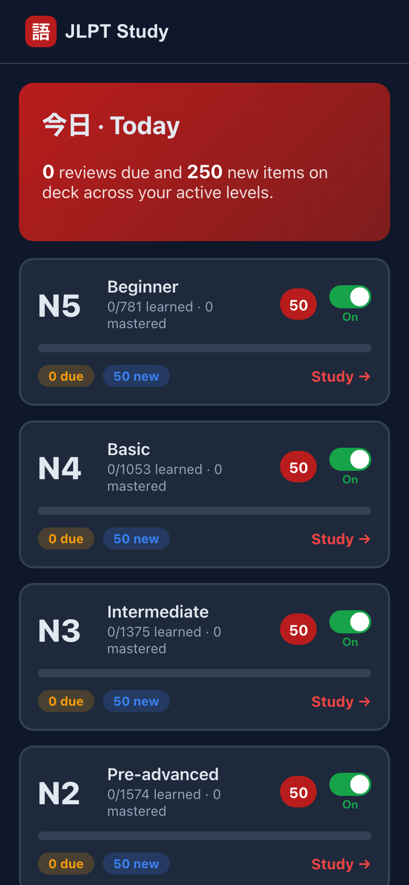
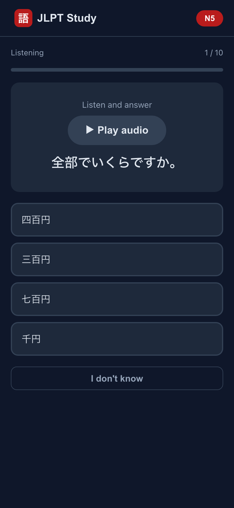
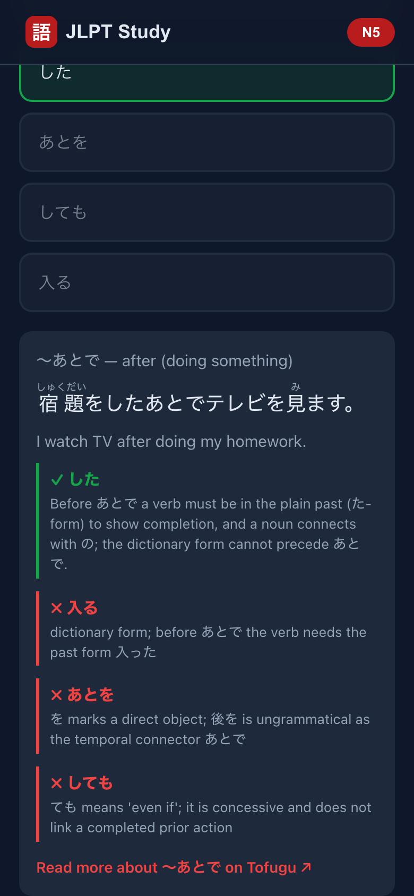

# JLPT Study

**▶ Live app: https://ulasb.github.io/jlpt-study/**

A web app for studying the JLPT (Japanese-Language Proficiency Test) across **kanji**, **vocabulary**, **grammar**, **reading**, and **listening**, with spaced repetition. Built as an offline-first PWA — install it to your phone's home screen or run it in any browser.

<p align="center">
  
  &nbsp;
  
  &nbsp;
  
</p>

## Levels

**All five levels (N5–N1) are populated.**

| Level | Kanji | Vocab | Grammar | Reading | Listening |
|-------|------:|------:|--------:|--------:|----------:|
| N5    |   104 |   543 |      94 |      20 |        20 |
| N4    |   201 |   631 |     181 |      20 |        20 |
| N3    |   332 |   837 |     166 |      20 |        20 |
| N2    |   363 |   896 |     275 |      20 |        20 |
| N1    | 1,225 |   917 |     184 |      20 |        20 |

(Counts are auto-derived from the content — see [Content](#content).)

## Features

- **Spaced repetition (SM-2)** — each item is scheduled by how well you recall it (Again / Hard / Medium / Easy).
- **Kanji & vocab flashcards** — multiple choice with scrambled options. Readings are hidden until you answer (you're tested on them), then shown. Cards mix directions (meaning→kanji, reading→kanji, word→meaning, …), and distractors are filtered so a wrong option can never be secretly correct (no homophones for reading questions, no synonyms for meaning questions).
- **Grammar fill-in-the-blank** — pick the form that fits the sentence. Where a single sentence would be ambiguous, a **context sentence** is shown to pin down the intended answer. After answering you get an explanation of *why the answer is right* and *why each shown distractor is wrong* (with furigana), plus a link to the relevant **Tofugu** grammar article.
- **Reading comprehension** — level-graded passages (short notes and notices at N5 up to editorials and essays at N1), shown without furigana like the real exam, each with multiple-choice comprehension questions. The reveal shows the passage with furigana, its full translation, and why each option is right or wrong.
- **Listening comprehension** — JLPT-style dialogues and announcements played as audio (script hidden, like the real exam), with distinct male/female voices per speaker and slower pacing at lower levels. The reveal shows the full transcript with furigana, a translation, and per-option explanations.
- **"I don't know"** option so you never have to guess randomly.
- **Home dashboard** — progress and what's due "today" across every level, with a per-level **On/Off** toggle to pause levels you're not focusing on.
- **Browse / learn** — read through kanji, vocab, grammar points, reading passages, and listening transcripts outside of quizzing.
- **Sample exam** — a mixed multiple-choice test across all five dimensions.
- **Report a problem** — a flag button on any exercise so bad items can be found and fixed (see [Analytics](#analytics-optional)).
- **Offline & local** — all content and your progress live on-device (IndexedDB); no account, no server.
- **Optional Google Drive sync** — sign in to continue your progress on another device. Entirely opt-in; the app works exactly as before if you never do (see [Google Drive sync](#google-drive-sync-optional)).

## Tech

- React + Vite + TypeScript
- Dexie (IndexedDB) for storage; content is lazy-loaded per level
- `vite-plugin-pwa` for offline/install support
- Wrapped for Android via [Capacitor](https://capacitorjs.com/) from the same codebase (see [Android](#android-capacitor))

## Development

```bash
npm install
npm run dev        # local dev server
npm run build      # production build
npm run preview    # preview the production build
npm run typecheck  # type-check only
```

## Android (Capacitor)

The same web app is wrapped for Android with Capacitor — no rewrite; it loads the built web assets inside a native shell.

Listening audio is **not bundled into the APK** (it would add ~140 MB): the Capacitor build strips `dist/audio`, and the app downloads each file from the deployed site on first play, caching it on-device for offline replays (`src/lib/audio.ts`).

**Prerequisites (local machine):** [Android Studio](https://developer.android.com/studio) (which provides the Android SDK) and **JDK 21** (Capacitor 8 compiles against Java 21). On macOS: `brew install openjdk@21`.

```bash
npm run cap:sync   # build the web app (relative base) and copy it into android/
npm run android    # sync, then open the project in Android Studio
```

In Android Studio, let Gradle sync, then **Run** on an emulator or a connected device. To produce a release APK/AAB, use **Build → Generate Signed Bundle / APK**.

### Building from the command line

```bash
export JAVA_HOME="$(/usr/libexec/java_home -v 21)"   # or brew's openjdk@21 path
export ANDROID_HOME="$HOME/Library/Android/sdk"
npm run cap:sync
cd android && ./gradlew assembleDebug
# → android/app/build/outputs/apk/debug/app-debug.apk
adb install -r app/build/outputs/apk/debug/app-debug.apk   # to a connected device/emulator
```

### App icons & splash

Launcher icons and splash screens are generated from `assets/logo.svg` with [`@capacitor/assets`](https://github.com/ionic-team/capacitor-assets). To regenerate after changing the logo:

```bash
npx capacitor-assets generate --android \
  --iconBackgroundColor '#b91c1c' --iconBackgroundColorDark '#b91c1c' \
  --splashBackgroundColor '#0f172a' --splashBackgroundColorDark '#0f172a'
```

Notes:
- `npm run build:cap` builds with `base: './'` and no service worker (correct for the native webview); the GitHub Pages build keeps `base: '/jlpt-study/'` + PWA.
- App id is `com.ulasb.jlptstudy` (see `capacitor.config.ts`).
- The `android/` native project (including generated launcher/splash assets) is committed; the sync-copied web bundle is gitignored and recreated by `npm run cap:sync`, so run it once after cloning before opening Android Studio.

## Deployment

Pushing to `main` triggers a GitHub Actions workflow (`.github/workflows/deploy.yml`) that builds the app and publishes it to GitHub Pages. Routing uses a hash router, so deep links work without server rewrites.

## Content

JLPT content lives in `src/data/<level>.ts` (kanji/vocab/grammar), `src/data/reading-<level>.ts` (reading passages), and `src/data/listening-<level>.ts` (listening scripts). It's loaded lazily per level (dynamic import) and seeded into IndexedDB on demand (`src/db/seed.ts`).

Listening audio (`public/audio/listening/`) is pre-generated from the scripts with Google Cloud Text-to-Speech by `scripts/gen-audio.mjs` — one `.m4a` per item, distinct voices per speaker, with every kanji's pronunciation pinned to the script's furigana via SSML. Audio is fetched on first play and runtime-cached by the service worker (it is not part of the PWA precache). Regenerate with `GOOGLE_TTS_API_KEY=... node scripts/gen-audio.mjs` (or `GOOGLE_APPLICATION_CREDENTIALS=<service-account.json>`). Content was generated and verified against reference sources; corrections are welcome via PR (or use the in-app flag button).

`src/data/meta.ts` (per-level item counts used by the Home overview) is **auto-generated** from the content files by `scripts/gen-meta.mjs`, which runs before every `dev`/`build` — so the totals can't drift from the data. Regenerate manually with `npm run gen:meta`.

Each item has a stable id (`<dimension>:<level>:<key>`, e.g. `kanji:N3:政`, `vocab:N2:提案`, `grammar:N2:において` — the `～` is stripped from grammar ids) used for seeding, dedup, and flag tracking.

## Google Drive sync (optional)

By default the app is account-free and everything stays on the device. Signing in with Google (**Settings → Sync with Google Drive**) additionally keeps your progress in **your own** Google Drive, so you can carry on from another device.

**What's stored:** one JSON file, `jlpt-study-progress.json`, holding your SRS review history and your preferences (selected level, new-items-per-day, paused levels). JLPT content itself is bundled with the app and never uploaded.

**Where:** Drive's `appDataFolder` — a hidden folder that only this app can see. The single scope requested is `drive.appdata`, which **cannot read, list, or modify any of your own Drive files**. It's a non-sensitive scope, so it needs no Google security assessment. Signing out revokes the grant; the file stays until you delete it (Drive → Settings → Manage apps).

**How merging works** (`src/sync/snapshot.ts`) — sync is peer-to-peer through the file, with no server to arbitrate, so the merge is deliberately conservative:

- Review rows merge **per item**, most recently studied wins. Studying different items on two devices keeps both, so nothing is lost by syncing late or working offline.
- Resetting a level's progress writes a **reset marker**; rows for that level older than the marker are dropped on merge, so a reset isn't undone by a device that still holds the old rows.
- Preferences move as one block, from whichever device changed them last.

The merge is symmetric and idempotent, so the order devices sync in doesn't matter and an interrupted sync is simply retried. Syncs run on startup, a few seconds after you finish answering, when you leave the page, and via **Sync now**.

**Browser only.** Google refuses OAuth inside embedded WebViews, so sync is unavailable in the Capacitor Android build — Settings says so instead of offering a button that would fail. Supporting it natively would mean adding a Google Sign-In Capacitor plugin plus an Android-type OAuth client registered with the signing keys' SHA-1 fingerprints. The auth layer (`src/sync/googleAuth.ts`) is isolated behind `syncAvailable()` so that can be added without touching the merge or UI code.

### Setup

Like analytics, the feature is **hidden unless a client ID is configured** — no Google code is loaded without one.

1. In the [Google Cloud Console](https://console.cloud.google.com/), create or select a project.
2. **APIs & Services → Library** → enable the **Google Drive API**.
3. Configure the **OAuth consent screen** (app name, support email, developer contact) and add the scope `https://www.googleapis.com/auth/drive.appdata`.
4. **Credentials → Create credentials → OAuth client ID → Web application**. Under **Authorized JavaScript origins** add the origins you serve from — origins only, no path:
   - `https://ulasb.github.io` (the deployed site)
   - `http://localhost:5173` (dev) and `http://localhost:4173` (`npm run preview`)
5. Copy the client ID and set it as a repo Actions variable named `VITE_GOOGLE_CLIENT_ID` (**Settings → Secrets and variables → Actions → Variables**), then trigger a deploy. *(Inlined at build time, so changing it needs a rebuild.)* A browser OAuth client ID is public by design — it isn't a secret; access is limited by the authorized origins above.
6. **Publish** the consent screen. While it's in *Testing*, only accounts you list as test users can sign in (max 100).

For local testing put `VITE_GOOGLE_CLIENT_ID=…` in `.env.local` and run `npm run dev`.

### Troubleshooting

**"The Google Drive API has not been used in project … or it is disabled"** — step 2 was skipped. Creating an OAuth client does *not* enable the Drive API; they're separate steps, and sign-in will appear to succeed (you'll even see your email) because the token is fine — it's the first Drive call that gets a 403. Enable the API, wait a minute for it to propagate, then hit **Reconnect**.

**"Reconnect to resume syncing" on startup, with no error** — normal. Access tokens last about an hour and Google's popup can only open from a user gesture, so a background sync after the token expires can't silently renew it. One tap on **Reconnect** or **Sync now** restores it, and every background sync for the next hour then works from the cached token.

**Sign-in popup never appears** — check the browser didn't block it, and that the origin you're on is in the client's authorized origins (`http://localhost:5173` ≠ `http://127.0.0.1:5173` — Google treats those as different origins).

## Analytics (optional)

Usage analytics use **Google Analytics 4** and are **disabled unless a Measurement ID is configured** — nothing loads without it, and analytics never runs in dev (production builds only). All tracking goes through `src/lib/analytics.ts`, so the provider can be swapped in one file. On the live site, GA only loads **after the user accepts the cookie-consent banner** (choice is stored locally; changeable in Settings).

To enable on the deployed site:
1. Create a GA4 property and copy its Measurement ID (`G-XXXXXXXXXX`).
2. In the GitHub repo: **Settings → Secrets and variables → Actions → Variables → New repository variable**, named `VITE_GA_ID`, value = your ID.
3. Trigger a deploy (push to `main`, or the Actions tab → Run workflow). The build inlines the ID. *(Changing the ID requires a rebuild — it's inlined at build time.)*

For local production testing, put `VITE_GA_ID=G-…` in `.env.local` and run `npm run build && npm run preview`.

**Events tracked** (beyond page views): `select_level`, `study_start`, `answer` (grade + `is_correct`), `study_complete` (with `accuracy`), `exam_start`, `exam_complete`, `browse_open`, and `flag_item` (user-reported bad exercise) — each tagged with level/dimension so you can see study behavior, not just traffic.

### GA4 custom definitions (to see accuracy & flags in reports)

GA4 collects event parameters automatically, but you must register them once to use them in reports (**Admin → Custom definitions**):

- **Study accuracy** — register `is_correct` as a **custom metric** (event `answer`). In an Exploration, the *average* of `is_correct` is your accuracy; break it down by the `level` / `dimension` custom dimensions. (`study_complete` also carries a per-session `accuracy` 0–100 metric.)
- **Flagged exercises** — register `item` as a **custom dimension**. The `flag_item` event count tells you *how often* users flag problems; the `item` dimension tells you *which exercise* (its stable id, e.g. `grammar:N3:ように`) so you can find and fix it. Register `level`/`dimension`/`grade` as custom dimensions too if you want to slice by them.

**Privacy:** GA4 sets cookies, so the app shows a **cookie-consent banner** and loads GA only after the user accepts. Prefer no cookies at all? Swap `src/lib/analytics.ts` for a privacy-first provider (Plausible, Cloudflare, GoatCounter).
